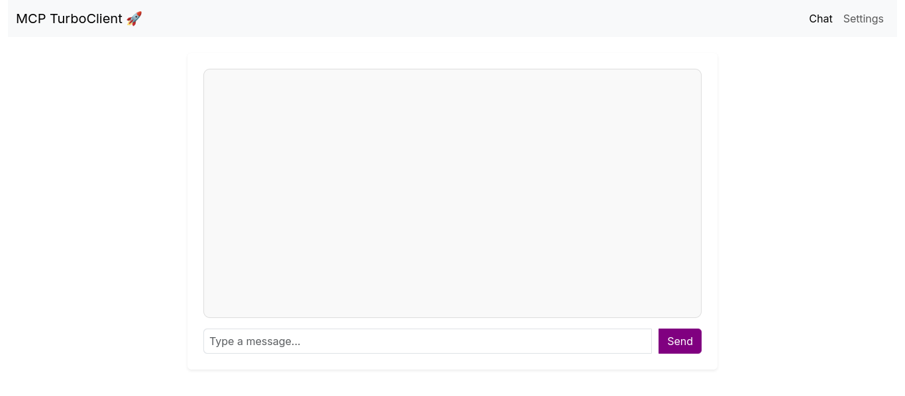
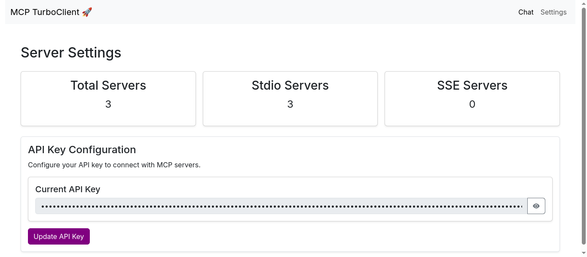

# Turbo MCP Client [🚀](http://127.0.0.1:8080/#)

A FastAPI-based application that provides a web interface for interacting with Models Context Protocol (MCP) servers while utilizing OpenAI's API for processing messages.

## Overview

This application allows users to:

- Connect to multiple MCP servers simultaneously
- Process messages through OpenAI's API
- Interact with the system via a web-based chat interface
- Configure and store API license keys

## Tech Stack

**Client:** html, css, js, bootstrap, animatedjs

**Server:** FastAPI, Openai, MCP

## Features

- Connect multiple servers at a time
- Use websocket any where you want

## Screenshots





## Installation

1. Clone the repository:

   ```bash
   git clone https://github.com/techspawn/MCP-TurboClient.git
   cd openai-mcp
   ```
2. Install dependencies:

   ```bash
   uv pip install -r requirements.txt
   ```
3. Set up your environment variables:

   ```bash
   export MODEL_NAME="gpt-4o" # or your preferred OpenAI model
   ```

## Environment Variables

To run this project, you will need to add the following environment variables to your .env file

`MODEL_NAME=gpt-4o`

## Configuration

1. Create a `config.json` file in the root directory:

   ```json
   {
     "mcpServers": {
       "server1": {
         "command": "your_command",
         "args": ["arg1", "arg2"]
       },
       "server2": {
         "command": "another_command",
         "args": ["arg1", "arg2"]
       }
     }
   }
   ```
2. Initialize the SQLite database:

   ```python
   import sqlite3

   conn = sqlite3.connect("mcp_config.db")
   cursor = conn.cursor()
   cursor.execute("CREATE TABLE IF NOT EXISTS config (license_key TEXT)")
   conn.commit()
   conn.close()
   ```
3. Configure your OpenAI API key through the web interface.

## Usage

1. Start the application:

   ```bash
   uvicorn main:app --reload
   ```
2. Open your browser and navigate to `http://localhost:8000`
3. Enter your OpenAI API key in the web interface to save it to the database
4. Use the chat interface to send messages that will be processed through the MCP servers and OpenAI

## Usage

1. Start the application:

   ```bash
   uvicorn main:app --reload
   ```
2. Open your browser and navigate to `http://localhost:8000`
3. Enter your OpenAI API key in the web interface to save it to the database
4. Use the chat interface to send messages that will be processed through the MCP servers and OpenAI

## Project Structure

```
├── images/                    # Directory for storing image assets
│   ├── chat_window.png        # Screenshot of the chat window
│   └── setting_page.png       # Screenshot of the settings page
├── models/                    # Contains Python modules related to data models
│   ├── __init__.py            # Makes the 'models' directory a Python package
│   ├── client.py              # Defines client-related logic (e.g., API client, user handling)
│   ├── config.py              # Handles application configuration settings
│   └── py.typed               # Indicates that this package supports type hints
├── static/                    # Placeholder for static assets (CSS, JavaScript, images)
├── templates/                 # Directory for HTML templates
│   ├── base.html              # Base template for consistent layout across pages
│   ├── chat.html              # Template for the chat interface
│   └── settings.html          # Template for the settings page
├── .env                       # Environment variables (e.g., API keys, credentials)
├── .gitignore                 # Specifies files to be ignored by Git
├── .python-version            # Defines the Python version for this project
├── config.json                # JSON configuration file for application settings
├── database.py                # Handles database connection and operations
├── folder_structure.txt        # Text file describing the project structure
├── LICENSE                    # License file specifying usage terms
├── main.py                     # Entry point of the application
├── mcp_config.db               # SQLite database file or config storage
├── pyproject.toml              # Python project metadata and dependency management
├── README.md                   # Project documentation and setup instructions
├── requirements.txt            # List of required dependencies
└── uv.lock                     # Lock file for package versions (possibly from `uv` or another package manager)

```

## API Endpoints

- `GET /`: Main chat interface
- `POST /get_settings`: Save OpenAI API license key
- `WebSocket /chat`: Real-time chat communication

## Contributing

Contributions are always welcome!

See `contributing.md` for ways to get started.

## Support

For support, email [support@techspawn.com](support@techspawn.com)

## License

[MIT](https://choosealicense.com/licenses/mit/)
